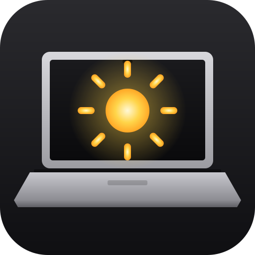
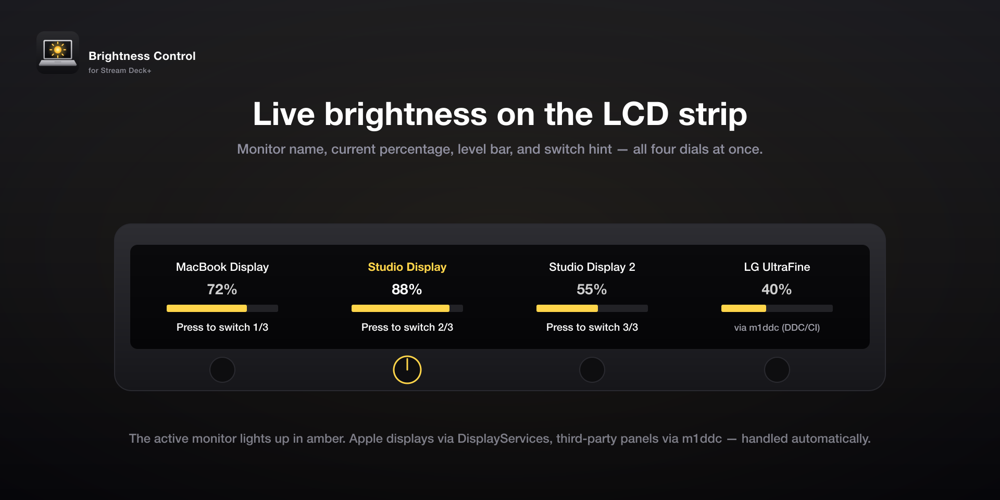
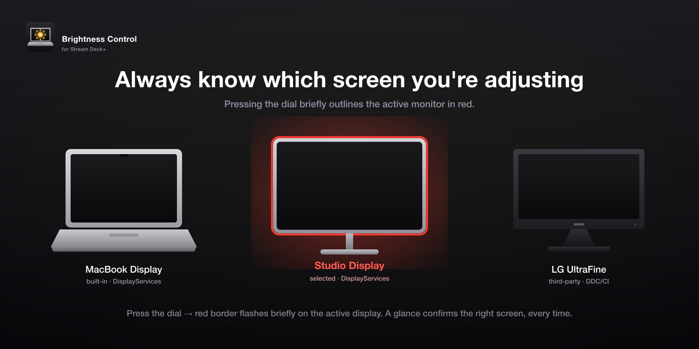
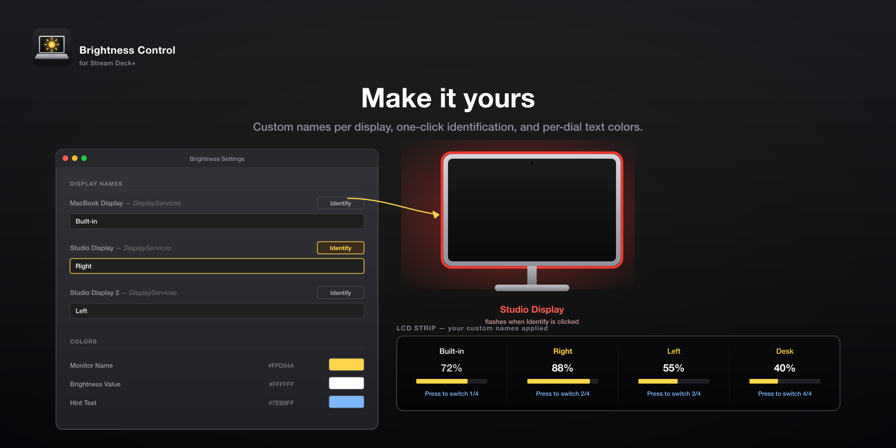

  

<h1 align="center">Brightness Control</h1>

<em>Stream Deck+ plugin for Mac display brightness</em>

  
  
  
  

Adjust the brightness of every Mac-connected display directly from your Stream Deck+ dials. Built on Apple's native DisplayServices — works reliably with Apple Studio Display, Pro Display XDR, and the built-in MacBook display where most third-party tools fail.

> 🚀 **Quickstart:** Install via [**Elgato Marketplace**](https://marketplace.elgato.com/product/brightness-control-54d6a22a-2fe4-47a3-a0a1-9204efc5232b) (one click inside the Stream Deck app), or [download the bundle](https://github.com/Corrugator/streamdeck-mac-brightnesser/releases/latest) here for manual install.

---

## What it does

### Live brightness on every dial

Each dial controls one display. Rotate to adjust brightness in 2 % steps, press to cycle through every connected monitor. The LCD shows monitor name, exact percentage, a live bar, and a switch hint such as `Press to switch 2/3`.

### Always know which screen you're tuning

Pressing a dial briefly outlines the active monitor in red — a quick glance confirms you're tuning the right screen, especially handy with two identical displays side by side.

### Make it yours

Pick custom text colors per dial. Rename each display to whatever makes sense to you ("Right", "Left", "Desk") — names persist across reboots and re-plugs. While editing, click **Identify** to flash the matching physical monitor in red so you always know which one you're naming.

---

## Features at a glance

- **Rotate to adjust** — 2 % brightness step per dial tick
- **Press to switch monitor** — cycles through every connected display
- **Active-display indicator** — red border briefly flashes on the selected screen
- **Rename displays** — custom names that persist across reboots and re-plugs
- **Identify button** — flashes a monitor in red so you can match name to hardware
- **Custom text colors** — per dial via Property Inspector
- **Auto-refresh** every 10 s — keeps in sync with external brightness changes
- **Privacy-respecting** — diagnostic logging is opt-in (off by default)
- **Universal Binary** — single helper covers Apple Silicon and Intel

---

## Supported displays

| Display | How it's driven |
|---|---|
| MacBook built-in | Apple DisplayServices |
| Apple Studio Display | Apple DisplayServices |
| Apple Pro Display XDR | Apple DisplayServices |
| Apple Thunderbolt Display | Apple DisplayServices |
| Other DDC/CI monitors | optional [`m1ddc`](https://github.com/waydabber/m1ddc) fallback |

The DisplayServices path uses the same private framework macOS itself uses for the System Settings brightness slider — that's why this plugin handles Studio Display and Pro Display XDR cleanly.

## Requirements

- macOS 12 (Monterey) or newer
- Stream Deck App 6.9 or newer
- Stream Deck+ (encoder/dial hardware)
- *Optional:* `brew install m1ddc` for non-Apple DDC/CI displays

## Installation

**Recommended — Elgato Marketplace:**
[Brightness Control on the Marketplace](https://marketplace.elgato.com/product/brightness-control-54d6a22a-2fe4-47a3-a0a1-9204efc5232b) — open the link in the Stream Deck app and click install.

**Manual — from GitHub:**

1. Download `com.corrugator.brightness.streamDeckPlugin` from the [latest release](https://github.com/Corrugator/streamdeck-mac-brightnesser/releases/latest).
2. Double-click the file. The Stream Deck app installs it automatically.
3. Drag the **Brightness** action onto a Stream Deck+ dial.

## Privacy

- 100 % local — no telemetry, no analytics, no network calls outside the local Stream Deck WebSocket.
- Diagnostic logging is **opt-in** — off by default. Enable from the Property Inspector when troubleshooting; logs stay in `~/Library/Logs/ElgatoStreamDeck/`, never leave your machine.

## Known limitations

- macOS only — DisplayServices is an Apple-private API.
- Some inexpensive USB-C monitors expose neither DisplayServices nor DDC/CI — those will not appear in the display list.
- Apple may change DisplayServices in a future macOS release without notice; this plugin will need a patch if/when that happens.

## License

See [LICENSE](LICENSE).
